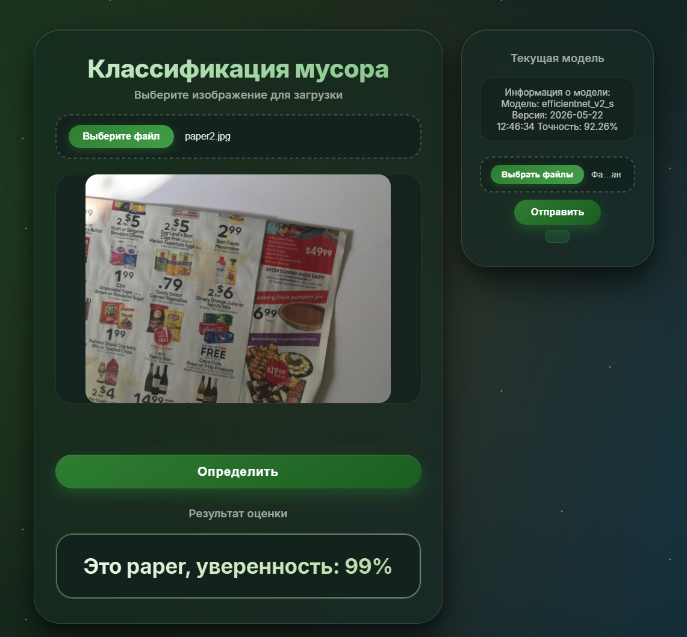

# 🗑️ Классификация мусора по фото

Веб-сервис для определения типа мусора по фотографии с использованием глубокого обучения. 
Пользователь загружает изображение, модель определяет категорию отходов и выдаёт результат с уверенностью.



## 🚀 Возможности

- **Загрузка изображений** - пользователь может загрузить фото мусора.
- **Мгновенное распознавание** - модель EfficientNetV2 определяет тип отходов (< 1 секунды).
- **Автоматическое дообучение**:
  - Можно загружать новые размеченные данные через веб-интерфейс.
  - Модель автоматически дообучается на новых данных и обновляется.
- **Отображение уверенности модели** - пользователь видит процент уверенности в предсказании.

## 🛠️ Технологии

- **Backend** Flask, sqlite3
- **ML модель** EfficientNetV2_s, PyTorch
- **Обработка изображений** torchvision
- **Фронтенд** HTML, CSS, bootstrap
- **Инструменты** Python 3.11+, uv, Git


## ⚡ Быстрый старт


### Предварительные требования

- Python 3.11 или выше
- [uv](https://github.com/astral-sh/uv) - менеджер пакетов
- Git

### Установка и запуск

1. **Клонируйте репозиторий:**
   ```bash
   git clone https://github.com/elr1d/project_cv.git
   cd project_cv
   ```

2. **Создайте виртуальное окружение:**
   ```bash
   uv venv
   ```

3. **Установите зависимости:**
   ```bash
   uv sync
   ```
4.**Скачайте предобученную модель**
   https://drive.google.com/file/d/1nPSjXubmo0j2gCDCTrAID4HRrTYCL456/view?usp=sharing

   и скопируйте её в папку `app/models/`

5. **Запустите сервер разработки:**
   ```bash
   uv run python -m app.website.backend
   ```

6. **Откройте в браузере:**
   http://127.0.0.1:5000

### 🧠 О модели

**Архитектура**: EfficientNetV2_s (предобучена на ImageNet).

**Входные признаки**: cardboard, glass, metal , paper, plastic, trash.

**Обучение**: Базовые слои заморожены, переобучены последние 3 блока.

**Оптимизатор**: Adam.

**Планировщик**: ReduceLROnPlateau(плато) + early stopping.

**Аугментация данных**: повороты, горизонтальное отражение.

**Качество модели**: Точность: 92% на тестовой выборке.

## 🔄 Автоматическое дообучение 

**Сервис поддерживает дозагрузку данных через интерфейс:**

**Загрузка папки с новыми изображениями и метками.**

Программа автоматически:

Валидирует данные.

Загружает их в бд и на сервер.

Запускает дообучение модели.

Сохраняет обновлённую модель и обновляет метаданные (версия, дата, точность).

Новая модель автоматически подхватывается сервисом для работы.

**Техническая реализация:**

Фоновый процесс с использованием threading.

## Обучение модели

Процесс обучения модели описан в Jupyter-ноутбуке: [app/train/initial_train.ipynb](app/train/initial_train.ipynb)

## 📁Структура проекта
```plaintext
project_cv/
├── app/                               # Основное Flask-приложение
│   ├── website/                       # Веб-интерфейс
│   │   ├── static/                    # CSS, JS, изображения
│   │   ├── templates/                 # HTML-шаблоны
│   │   │   └── index.html             # Главная страница
│   │   └── __init__.py                # Инициализация Flask-приложения
│   ├── models/                        # Сохранённые модели
│   │   └── model.pth                  # Текущая модель
│   ├── train/                         # Скрипты обучения и дообучения
│   │   ├── initial_train.ipynb        # Базовое обучение
│   │   ├── retrain.py                 # Дообучение на новых данных
│   ├── data/                          # Датасеты
│   │   ├── full_data/                 # Полный исходный датасет
│   │   │   ├── cardboard/
│   │   │   ├── glass/
│   │   │   ├── metal/
│   │   │   ├── paper/
│   │   │   ├── plastic/
│   │   │   └── trash/
│   │   ├── train/                     # Обучающая выборка
│   │   ├── test/                      # Тестовая выборка
│   │   ├── val/                       # Валидационная выборка
│   │   └── uploaded_train/            # Данные, загруженные через сайт для дообучения
│   ├── DATABASE/                      
│   ├── DB_CREATE.py                   # Создание БД
    └── DB_FUNC.py                     # Функции БД
├── screenshots/                       # Скриншоты для README
│   └── image.png
├── .gitignore
├── .python-version
├── pyproject.toml                     # Зависимости (uv)
├── uv.lock                            # Блокировка версий
├── README.md
└── LICENSE
```

### 📄 Лицензия
Этот проект распространяется под лицензией MIT. Подробнее в файле LICENSE.

### 📬 Контакты
Автор: Тимур

GitHub: https://github.com/elr1d

Email: h4rons@yandex.ru


### 🙏 Благодарности
Данные для обучения модели взяты с https://www.kaggle.com/datasets/asdasdasasdas/garbage-classification

Дизайн-макет интерфейса создан при помощи генеративных нейронных сетей и доработан вручную.